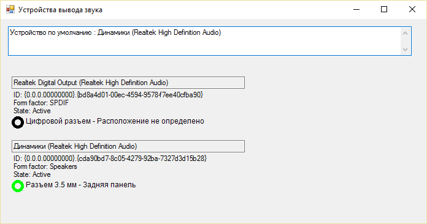

# Получение информации об устройствах вывода звука в Windows (C#)

*(Статья написана 27.09.2017, перенесена со старого сайта.)*

Иногда возникает необходимость определения присутствующих в системе устройств вывода звука, и какие из них активны в текущий момент. Для этих целей можно использовать Windows [Multimedia Device API](https://msdn.microsoft.com/en-us/library/windows/desktop/dd316556(v=vs.85).aspx). Его интерфейс IMMDeviceEnumerator позволяет получить список устройств вывода звука (audio endpoints), их тип и различную информацию о них. Однако, в современных звуковых картах часто динамики и наушники представлены одним устройством с точки зрения системы, и выбор, на какое устройство выводить звук, осуществляется в настройках специальной утилиты производителя (или автоматически). В таком случае для определения путей вывода звука в кокретной ситуации можно использовать [Device Topology API](https://msdn.microsoft.com/en-us/library/windows/desktop/dd370825(v=vs.85).aspx). С помощью него можно получить информацию о разъемах звукового адаптера и их состоянии.

Для доступа к этим API из C# нам понадобятся декларации неуправляемых структур, интерфейсов и т.п. из библиотек Mmdeviceapi.h и Devicetopology.h, а также COM-объекта Property Store:

```
using System;
using System.Collections.Generic;
using System.Text;
using System.Runtime.InteropServices;
using System.IO;
using System.Runtime.CompilerServices;

namespace com_test
{
    class Native
    {
        [DllImport("ole32.Dll")]
        static public extern uint CoCreateInstance(ref Guid clsid,
        [MarshalAs(UnmanagedType.IUnknown)] object inner, uint context, ref Guid uuid,
        [MarshalAs(UnmanagedType.IUnknown)] out object rReturnedComObject);

        //************************************************************************
        [DllImport("ole32.dll")]
        private extern static int PropVariantClear(ref PropVariant pvar);

        public const int DEVICE_STATE_ACTIVE = 0x00000001;
        public const int DEVICE_STATE_DISABLE = 0x00000002;
        public const int DEVICE_STATE_NOTPRESENT = 0x00000004;
        public const int DEVICE_STATE_UNPLUGGED = 0x00000008;
        public const int DEVICE_STATEMASK_ALL = 0x0000000f;
                

        public static PROPERTYKEY PKEY_Device_FriendlyName = 
            new PROPERTYKEY(0xa45c254e, 0xdf1c, 0x4efd, 0x80, 0x20, 0x67, 0xd1, 0x46, 0xa8, 0x50, 0xe0, 14);
        
        public static PROPERTYKEY PKEY_AudioEndpoint_FormFactor = 
            new PROPERTYKEY(0x1da5d803, 0xd492, 0x4edd, 0x8c, 0x23, 0xe0, 0xc0, 0xff, 0xee, 0x7f, 0x0e, 0);

    }

    enum EndpointFormFactor
    {
        RemoteNetworkDevice	= 0,
        Speakers	= ( RemoteNetworkDevice + 1 ) ,
        LineLevel	= ( Speakers + 1 ) ,
        Headphones	= ( LineLevel + 1 ) ,
        Microphone	= ( Headphones + 1 ) ,
        Headset	= ( Microphone + 1 ) ,
        Handset	= ( Headset + 1 ) ,
        UnknownDigitalPassthrough	= ( Handset + 1 ) ,
        SPDIF	= ( UnknownDigitalPassthrough + 1 ) ,
        DigitalAudioDisplayDevice	= ( SPDIF + 1 ) ,
        UnknownFormFactor	= ( DigitalAudioDisplayDevice + 1 ) ,
        EndpointFormFactor_enum_count	= ( UnknownFormFactor + 1 ) 
    };

    enum EPcxConnectionType
    {
        eConnTypeUnknown=0,
        eConnType3Point5mm,
        eConnTypeQuarter,
        eConnTypeAtapiInternal,
        eConnTypeRCA,
        eConnTypeOptical,
        eConnTypeOtherDigital,
        eConnTypeOtherAnalog,
        eConnTypeMultichannelAnalogDIN,
        eConnTypeXlrProfessional,
        eConnTypeRJ11Modem,
        eConnTypeCombination
    } ;

    enum EPcxGeoLocation
    {
        eGeoLocRear = 0x1,
        eGeoLocFront,
        eGeoLocLeft,
        eGeoLocRight,
        eGeoLocTop,
        eGeoLocBottom,
        eGeoLocRearPanel,
        eGeoLocRiser,
        eGeoLocInsideMobileLid,
        eGeoLocDrivebay,
        eGeoLocHDMI,
        eGeoLocOutsideMobileLid,
        eGeoLocATAPI,
        eGeoLocNotApplicable,
        eGeoLocReserved6,
        EPcxGeoLocation_enum_count
    } ;

    public enum EDataFlow
    {
        eRender,
        eCapture,
        eAll,
        EDataFlow_enum_count
    }

    public enum ERole
    {
        eConsole,
        eMultimedia,
        eCommunications,
        ERole_enum_count
    }

    public enum CLSCTX : uint
    {
        CLSCTX_INPROC_SERVER = 0x1,
        CLSCTX_INPROC_HANDLER = 0x2,
        CLSCTX_LOCAL_SERVER = 0x4,
        CLSCTX_REMOTE_SERVER = 0x10,
        CLSCTX_SERVER = (CLSCTX_INPROC_SERVER | CLSCTX_LOCAL_SERVER |
                                                 CLSCTX_REMOTE_SERVER),
        CLSCTX_ALL = (CLSCTX_INPROC_HANDLER | CLSCTX_SERVER)
    };

    //Windows Core Audio API declarations
    //Источник: http://www.java2s.com/Code/CSharp/Windows/SoundUtils.htm

    [Guid("0BD7A1BE-7A1A-44DB-8397-CC5392387B5E"),
        InterfaceType(ComInterfaceType.InterfaceIsIUnknown)]
    public interface IMMDeviceCollection
    {       
        int GetCount(ref uint pcDevices); 
        int Item(uint nDevice, [Out, MarshalAs(UnmanagedType.Interface)] out object ppDevice);
    }

    [Guid("D666063F-1587-4E43-81F1-B948E807363F"),
    InterfaceType(ComInterfaceType.InterfaceIsIUnknown)]
    public interface IMMDevice
    {
        int Activate(ref Guid iid, uint dwClsCtx, IntPtr pActivationParams, 
            [Out, MarshalAs(UnmanagedType.Interface)] out object ppInterface);

        int OpenPropertyStore(int stgmAccess, [Out, MarshalAs(UnmanagedType.Interface)] out object ppProperties);

        int GetId(ref StringBuilder ppstrId);

        int GetState(ref int pdwState);
    }

    [ComImport, Guid("BCDE0395-E52F-467C-8E3D-C4579291692E")]
    class MMDeviceEnumerator
    {
    }

    [Guid("A95664D2-9614-4F35-A746-DE8DB63617E6"),    
    InterfaceType(ComInterfaceType.InterfaceIsIUnknown)]
    public interface IMMDeviceEnumerator
    {

         int EnumAudioEndpoints(EDataFlow dataFlow, int dwStateMask, 
             [Out, MarshalAs(UnmanagedType.Interface)] out object ppDevices);

         int GetDefaultAudioEndpoint(EDataFlow dataFlow, ERole role, 
             [Out, MarshalAs(UnmanagedType.Interface)] out object ppEndpoint);
                
         int  GetDevice(string pwstrId, ref IntPtr ppDevice);

         int  RegisterEndpointNotificationCallback(IntPtr pClient);

         int  UnregisterEndpointNotificationCallback(IntPtr pClient);
    }
      

    //*********** Property store *****************************

    //Источник: https://blogs.msdn.microsoft.com/adamroot/2008/04/11/interop-with-propvariants-in-net/

    [ComImport, Guid("886D8EEB-8CF2-4446-8D02-CDBA1DBDCF99"), InterfaceType(ComInterfaceType.InterfaceIsIUnknown)]
    interface IPropertyStore
    {
        [MethodImpl(MethodImplOptions.InternalCall, MethodCodeType = MethodCodeType.Runtime)]
        void GetCount([Out] out uint cProps);

        [MethodImpl(MethodImplOptions.InternalCall, MethodCodeType = MethodCodeType.Runtime)]
        void GetAt([In] uint iProp, out PROPERTYKEY pkey);

        [MethodImpl(MethodImplOptions.InternalCall, MethodCodeType = MethodCodeType.Runtime)]
        int GetValue([In] ref PROPERTYKEY key, out PropVariant pv);

        [MethodImpl(MethodImplOptions.InternalCall, MethodCodeType = MethodCodeType.Runtime)]
        void SetValue([In] ref PROPERTYKEY key, [In] ref object pv);

        [MethodImpl(MethodImplOptions.InternalCall, MethodCodeType = MethodCodeType.Runtime)]
        void Commit();
    }

    [StructLayout(LayoutKind.Sequential, Pack = 4)]
    struct PROPERTYKEY
    {
        public Guid fmtid;
        public uint pid;

        public PROPERTYKEY(Guid guid, int propertyId)
        {
            this.fmtid = guid;
            this.pid = (uint)propertyId;
        }
        public PROPERTYKEY(string formatId, int propertyId)
            : this(new Guid(formatId), propertyId)
        {
        }
        public PROPERTYKEY(uint a, uint b, uint c, uint d, uint e, uint f, 
            uint g, uint h, uint i, uint j, uint k, int propertyId)
            : this(new Guid((uint)a, (ushort)b, (ushort)c, (byte)d, (byte)e, 
                (byte)f, (byte)g, (byte)h, (byte)i, (byte)j, (byte)k), propertyId)
        {
        }
    }
    
    [StructLayout(LayoutKind.Sequential)]
    public struct PropVariant
    {
        ushort vt;
        ushort wReserved1;
        ushort wReserved2;
        ushort wReserved3;
        IntPtr p;
        int p2;

        private byte[] GetDataBytes()
        {
            byte[] ret = new byte[IntPtr.Size + sizeof(int)];
            if (IntPtr.Size == 4)
                BitConverter.GetBytes(p.ToInt32()).CopyTo(ret, 0);
            else if (IntPtr.Size == 8)
                BitConverter.GetBytes(p.ToInt64()).CopyTo(ret, 0);
            BitConverter.GetBytes(p2).CopyTo(ret, IntPtr.Size);
            return ret;
        }

        sbyte cVal // CHAR cVal;
        {
            get { return (sbyte)GetDataBytes()[0]; }
        }

        short iVal // SHORT iVal;
        {
            get { return BitConverter.ToInt16(GetDataBytes(), 0); }
        }

        int lVal // LONG lVal;
        {
            get { return BitConverter.ToInt32(GetDataBytes(), 0); }
        }

        long hVal // LARGE_INTEGER hVal;
        {
            get { return BitConverter.ToInt64(GetDataBytes(), 0); }
        }

        float fltVal // FLOAT fltVal;
        {
            get { return BitConverter.ToSingle(GetDataBytes(), 0); }
        }

        public object Value
        {
            get
            {
                switch ((VarEnum)vt)
                {
                    case VarEnum.VT_I1:
                        return cVal;
                    case VarEnum.VT_I2:
                        return iVal;
                    case VarEnum.VT_I4:
                    case VarEnum.VT_INT:
                        return lVal;
                    case VarEnum.VT_UI4:
                    case VarEnum.VT_I8:
                        return hVal;
                    case VarEnum.VT_R4:
                        return fltVal;
                    case VarEnum.VT_FILETIME: return DateTime.FromFileTime(hVal);
                    case VarEnum.VT_BSTR:
                        return Marshal.PtrToStringBSTR(p);
                    case VarEnum.VT_BLOB:
                        byte[] blobData = new byte[lVal];
                        IntPtr pBlobData;
                        if (IntPtr.Size == 4)
                        {
                            pBlobData = new IntPtr(p2);
                        }
                        else if (IntPtr.Size == 8)
                        {
                            pBlobData = new IntPtr(BitConverter.ToInt64(GetDataBytes(), sizeof(int)));
                        }
                        else
                            throw new NotSupportedException();
                        Marshal.Copy(pBlobData, blobData, 0, lVal);
                        return blobData;
                    case VarEnum.VT_LPSTR:
                        return Marshal.PtrToStringAnsi(p);
                    case VarEnum.VT_LPWSTR:
                        return Marshal.PtrToStringUni(p);
                    case VarEnum.VT_UNKNOWN:
                        return Marshal.GetObjectForIUnknown(p);
                    case VarEnum.VT_DISPATCH:
                        return p;
                    default:
                        throw new NotSupportedException("0x"+vt.ToString("X4") + " type not supported");
                }
            }
        }

    }
    //*****************************************************
        
    //Device Topology declarations

    [Guid("2A07407E-6497-4A18-9787-32F79BD0D98F"),
    InterfaceType(ComInterfaceType.InterfaceIsIUnknown)]
    public interface IDeviceTopology
    {
        int GetConnectorCount([Out] out int pConnectorCount);
        int GetConnector(int nIndex, out IConnector ppConnector);
        int GetSubunitCount([Out] out int pCount);
        int GetSubunit(int nIndex, out /*ISubunit*/object ppSubunit);
        int GetPartById(int nId, out IPart ppPart);
        int GetDeviceId([Out, MarshalAs(UnmanagedType.LPWStr)] out string ppwstrDeviceId);
        int GetSignalPath(IPart pIPartFrom, IPart pIPartTo, bool bRejectMixedPaths, /*IPartsList*/object ppParts);
    }

    
    [InterfaceType(ComInterfaceType.InterfaceIsIUnknown),
    Guid("9c2c4058-23f5-41de-877a-df3af236a09e")]
    public interface IConnector
    {
        int GetType(out int pType);
        int GetDataFlow(out EDataFlow dataFlow);
        int ConnectTo([In] IConnector connector);
        int Disconnect();
        int IsConnected(out bool pbConnected);        
        int GetConnectedTo([MarshalAs(UnmanagedType.Interface)] out object ppConTo);
        int GetConnectorIdConnectedTo(out string ppwstrConnectorId);
        int GetDeviceIdConnectedTo(out string ppwstrDeviceId);
    }

    [Guid("AE2DE0E4-5BCA-4F2D-AA46-5D13F8FDB3A9"),
    InterfaceType(ComInterfaceType.InterfaceIsIUnknown)]
    public interface IPart
    {
        int GetName(out StringBuilder ppwstrName);
        int GetLocalId(out int pnId);
        int GetGlobalId(out StringBuilder ppwstrGlobalId);
        int GetPartType(out int pPartType);
        int GetSubType(out Guid pSubType);
        int GetControlInterfaceCount(out uint pCount);

        int GetControlInterface(int nIndex, out /*IControlInterface*/ object ppFunction);
        int EnumPartsIncoming(out /*IPartsList[]*/object ppParts);
        int EnumPartsOutgoing(out /*IPartsList[]*/object ppParts);
               
        int GetTopologyObject([Out,MarshalAs(UnmanagedType.Interface)] out object ppTopology);

        int Activate(UInt32 dwClsContext,
                 ref Guid refiid,
                 [MarshalAs(UnmanagedType.Interface)] 
             out object interfacePointer);
        int RegisterControlChangeCallback(ref Guid riid, /*IControlChangeNotify*/object pNofity);
        int UnregisterControlChangeCallback(/*IControlChangeNotify*/object pNotify);
    }

    [ComVisible(false)]
    [ComImport,
    InterfaceType(ComInterfaceType.InterfaceIsIUnknown),
    Guid("4509F757-2D46-4637-8E62-CE7DB944F57B")]
    public interface IKsJackDescription
    {
        int GetJackCount(out uint jacks);
        int GetJackDescription(uint jack, ref KSJACK_DESCRIPTION pDescription);
    }

    [StructLayout(LayoutKind.Sequential)]
    public struct KSJACK_DESCRIPTION
    {
        public uint ChannelMapping;
        public uint Color;
        public uint ConnectionType;
        public uint GeoLocation;
        public uint GenLocation;
        public uint PortConnection;
        public uint IsConnected;
    } ;

}
```

Для вывода информации создадим форму в приложении WinForms с элементами TextBox и FlowLayoutPanel.

Создадим COM-объект MMDeviceEnumerator и обяъвим необходимые интерфейсы:

```
MMDeviceEnumerator devenum = new MMDeviceEnumerator();// CoClass
IMMDeviceEnumerator deviceEnumerator = (IMMDeviceEnumerator)devenum;
IMMDeviceCollection deviceCollection = null;
IMMDevice dev = null;
IMMDevice defDevice=null;
IPropertyStore propertyStore=null;
```

Устройство выода звука по умолчанию и его FriendlyName можно получить так:

```
deviceEnumerator.GetDefaultAudioEndpoint(EDataFlow.eRender, ERole.eConsole, out o);
defDevice = o as IMMDevice;

defDevice.OpenPropertyStore(0/*STGM_READ*/, out o);
propertyStore = o as IPropertyStore;
PropVariant name = new PropVariant();
propertyStore.GetValue(Native.PKEY_Device_FriendlyName, out name);
```

Для получения списка всех устройств используем следующий код:
 
```
deviceEnumerator.EnumAudioEndpoints(EDataFlow.eRender, 0x0000000F /*DEVICE_STATEMASK_ALL*/, out o);
deviceCollection = o as IMMDeviceCollection;
uint deviceCount = 0;
deviceCollection.GetCount(ref deviceCount);
```

Для вывода информации по устройству создадим метод PrintDevice

    string PrintDevice(IMMDevice dev)
    {
        IPropertyStore propertyStore = null;
        IDeviceTopology pDeviceTopology = null;
        IConnector pConnFrom = null;
        IConnector pConnTo = null;
        IPart pPart = null;
        IKsJackDescription pJackDesc = null;
        KSJACK_DESCRIPTION desc = new KSJACK_DESCRIPTION();

        StringBuilder res = new StringBuilder(300);
        StringBuilder id = new StringBuilder(500);
        object o = null;
        
        int state = 0;
        uint con_count = 0;

        FlowLayoutPanel pan = new FlowLayoutPanel();
        
        pan.Width = 390;
        pan.Height = 100;
        pan.FlowDirection = FlowDirection.TopDown;
        pan.WrapContents = false;

        try
        {

            //*********
            id = new StringBuilder(500);
            dev.GetId(ref id);                
            //*********

            //имя устройства
            dev.OpenPropertyStore(0/*STGM_READ*/, out o);                
            propertyStore = o as IPropertyStore;

            PropVariant friendlyName = new PropVariant();
            propertyStore.GetValue(Native.PKEY_Device_FriendlyName, out friendlyName);                
            res.AppendLine(friendlyName.Value.ToString());

            TextBox tb = new TextBox();
            tb.Text = friendlyName.Value.ToString();
            tb.Width = pan.Width - 10;
            tb.ReadOnly = true;
            pan.Controls.Add(tb);

            Label lab;
            lab = new Label(); lab.AutoSize = true;
            lab.Text = "ID: "+id.ToString(); pan.Controls.Add(lab);

            //form factor 
            PropVariant FormFactor = new PropVariant();
            propertyStore.GetValue(Native.PKEY_AudioEndpoint_FormFactor, out FormFactor);                
            EndpointFormFactor f=EndpointFormFactor.UnknownFormFactor;
            Enum.TryParse<EndpointFormFactor>(FormFactor.Value.ToString(), out f);
            res.AppendLine("Form factor: " + f.ToString());

            lab = new Label(); lab.AutoSize = true; 
            lab.Text = "Form factor: " + f.ToString();pan.Controls.Add(lab);

            //состояние устройства
            dev.GetState(ref state);                

            string str="";
            
            switch (state)
            {
                case Native.DEVICE_STATE_ACTIVE: str=("State: Active"); break;
                case Native.DEVICE_STATE_DISABLE: str = ("State: Disabled"); break;
                case Native.DEVICE_STATE_NOTPRESENT: str = ("State: Not present"); break;
                case Native.DEVICE_STATE_UNPLUGGED: str = ("State: Unplugged"); break;
            }
            
            res.AppendLine(str);

            lab = new Label(); lab.AutoSize = true;
            lab.Text = str; pan.Controls.Add(lab);

            /* DEVICE TOPOLOGY */
            Guid iidDeviceTopology = new Guid("2A07407E-6497-4A18-9787-32F79BD0D98F");
            dev.Activate(ref iidDeviceTopology, (uint)CLSCTX.CLSCTX_ALL, IntPtr.Zero, out o);                
            pDeviceTopology = o as IDeviceTopology;

            pDeviceTopology.GetConnector(0, out pConnFrom);                

            try
            {
                o = null;
                pConnFrom.GetConnectedTo(out o);
                pConnTo = o as IConnector;                    

                pPart = (IPart)pConnTo;//QueryInterface

                Guid iidKsJackDescription = new Guid("4509F757-2D46-4637-8E62-CE7DB944F57B");
                pPart.Activate((uint)CLSCTX.CLSCTX_INPROC_SERVER, ref iidKsJackDescription, out o);                    
                pJackDesc = (IKsJackDescription)o;

                if (pJackDesc != null)
                {
                    con_count = 0;
                    pJackDesc.GetJackCount(out con_count);
                    
                    if (con_count > 0)
                    {
                        StringBuilder sb;
                        Bitmap bmp;

                        //отобразить информацию о разъемах
                        for (uint i = 0; i < con_count; i++)
                        {
                            pJackDesc.GetJackDescription(i, ref desc);                                
                                                        
                            sb = new StringBuilder(100);
                            EPcxConnectionType con_type = (EPcxConnectionType)desc.ConnectionType;
                            EPcxGeoLocation loc = (EPcxGeoLocation)desc.GeoLocation;
                            res.Append("* ");

                            switch (con_type)
                            {
                                case EPcxConnectionType.eConnType3Point5mm: sb.Append("Разъем 3.5 мм ");
                                    break;
                                case EPcxConnectionType.eConnTypeAtapiInternal: sb.Append("Разъем ATAPI ");
                                    break;
                                case EPcxConnectionType.eConnTypeRCA: sb.Append("Разъем RCA ");
                                    break;
                                case EPcxConnectionType.eConnTypeQuarter: sb.Append("Разъем 1/2 дюйма ");
                                    break;
                                case EPcxConnectionType.eConnTypeOtherAnalog: sb.Append("Аналоговый разъем ");
                                    break;
                                case EPcxConnectionType.eConnTypeOtherDigital: sb.Append("Цифровой разъем ");
                                    break;
                                default: sb.Append(con_type.ToString()+" ");
                                    break;
                            }

                            switch (loc)
                            {
                                case EPcxGeoLocation.eGeoLocFront: sb.Append("- Передняя панель");
                                    break;
                                case EPcxGeoLocation.eGeoLocRear: sb.Append("- Задняя панель");
                                    break;
                                case EPcxGeoLocation.eGeoLocHDMI: sb.Append("- HDMI");
                                    break;
                                case EPcxGeoLocation.eGeoLocNotApplicable: sb.Append("- Расположение не определено");
                                    break;
                                default: sb.Append("- "+loc.ToString());
                                    break;
                            }
                            
                            if (desc.IsConnected == 0) sb.Append(" (Отключен)");

                            res.AppendLine(sb.ToString());
                            bmp = new Bitmap(pan.Width, 20);
                            
                            //генерация изображения
                            Graphics g = Graphics.FromImage(bmp);
                            
                            using (g)
                            {
                                //цвет получается сочетанием desc.Color и 0xFF для альфа-канала
                                Pen pen = new Pen(Color.FromArgb((int)(desc.Color | 0xFF000000)));
                                g.FillRectangle(SystemBrushes.Control, 0.0f, 0.0f, bmp.Width, bmp.Height);
                                using (pen)
                                {
                                    pen.Width = 5;
                                    g.DrawEllipse(pen, 2, 2, 15, 15);//нарисовать круг, используя цвет разъема
                                    Font fnt = new System.Drawing.Font(new FontFamily("Arial"), 9.0f);
                                    g.DrawString(sb.ToString(),fnt, Brushes.Black, 21, 0,StringFormat.GenericDefault);
                                }
                            }

                            PictureBox pb = new PictureBox();
                            pb.Image = bmp;
                            pb.SizeMode = PictureBoxSizeMode.AutoSize;
                            pan.Controls.Add(pb);
                            
                        }//end for
                    }
                    else
                    {
                        res.AppendLine("* Нет разъемов");
                        lab = new Label(); lab.Text = "* Нет разъемов";
                        lab.AutoSize = true;
                        pan.Controls.Add(lab);
                    }
                }
                else
                {
                    res.AppendLine("* Не удалось получить информацию о разъемах");
                    lab = new Label(); lab.Text = "* Не удалось получить информацию о разъемах";
                    lab.AutoSize = true;
                    pan.Controls.Add(lab);
                }                
            }
            catch (COMException ex)
            {
                if ((uint)ex.HResult == 0x80070490 /*E_NOTFOUND*/)
                {
                    res.AppendLine("Не подключен");
                    lab = new Label(); lab.Text = "* Не подключен";
                    lab.AutoSize = true;
                    pan.Controls.Add(lab);
                }
                else
                {
                    res.AppendLine("COM error: " + ex.Message);
                    lab = new Label(); lab.Text = "COM error: " + ex.Message;
                    lab.AutoSize = true;
                    pan.Controls.Add(lab);
                }
            }
            catch (Exception ex)
            {
                res.AppendLine("Не удалось получить информацию о разъемах: " + ex.Message);
                lab = new Label(); lab.Text = "Не удалось получить информацию о разъемах: " + ex.Message;
                lab.AutoSize = true;
                pan.Controls.Add(lab);
            }                

        }
        finally
        {
            //clean up resources                
            if (dev != null) Marshal.ReleaseComObject(dev);
            if (propertyStore != null) Marshal.ReleaseComObject(propertyStore);

            if (pDeviceTopology != null) { Marshal.ReleaseComObject(pDeviceTopology); pDeviceTopology = null; }
            if (pConnFrom != null) { Marshal.ReleaseComObject(pConnFrom); pConnFrom = null; }
            if (pConnTo != null) { Marshal.ReleaseComObject(pConnTo); pConnTo = null; }
            if (pPart != null) { Marshal.ReleaseComObject(pPart); pPart = null; }
            if (pJackDesc != null) { Marshal.ReleaseComObject(pJackDesc); pJackDesc = null; }                
        }

        int h = 0;
        foreach (Control c in pan.Controls){if (c.Bottom > h) h = c.Bottom;}
        pan.Height = h+10;

        flowLayoutPanel1.Controls.Add(pan);           
        return res.ToString();
    }

Сначала мы с помощью IMMDevice и IPropertyStore получаем общие свойства устройств. Затем получаем IDeviceTopology и находим объект IConnector, который символизирует разъемы нашего устройства. Из него получаем IKsJackDescription, который выдает список разъемов. Для разъемов можно узнать тип порта, его расположение (даже его цвет), а также статус (подключен/не подключен). Следует отметить, что не у всех разъемов есть электрический детектор подключения - для них статус всегда будет "Подключено". Используя эти данные, генерируем картинки разъемов и вставляем во FlowLayoutPanel.

Используем данную функцию для вывода всех устройств:

```
textBox1.Text = "Устройство по умолчанию : " + name.Value.ToString();
flowLayoutPanel1.Controls.Clear();

for (uint i = 0; i < deviceCount; i++)//вывести информацию о устройствах
{
    deviceCollection.Item(i, out o);
    dev = o as IMMDevice;
    PrintDevice(dev); 

    //clean up resources
    if (dev != null) { Marshal.ReleaseComObject(dev); dev = null; }
}
```

Окончательная очистка ресурсов COM:
 
```
if (devenum != null) Marshal.ReleaseComObject(devenum);
if (deviceEnumerator != null) Marshal.ReleaseComObject(deviceEnumerator);
if (deviceCollection != null) Marshal.ReleaseComObject(deviceCollection);
if (dev != null) Marshal.ReleaseComObject(dev);
if (defDevice != null) Marshal.ReleaseComObject(defDevice);
if (propertyStore != null) Marshal.ReleaseComObject(propertyStore);
```

Результат работы программы представлен на рисунке



[Полный проект (VS2012)](https://yadi.sk/d/ZvnQ7q6J3NJPhV)
