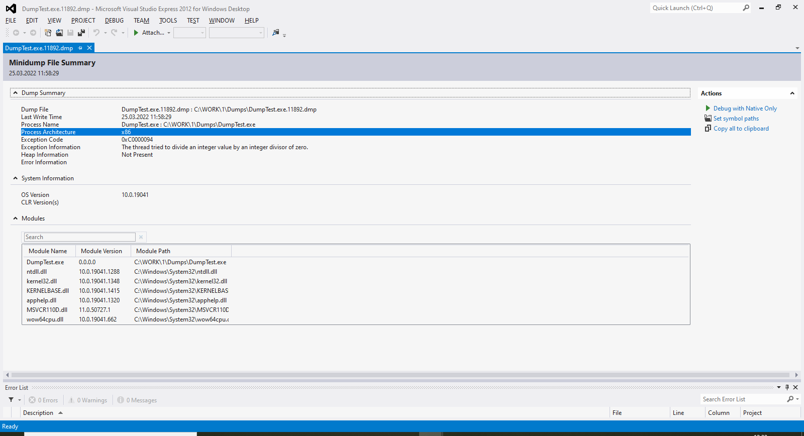
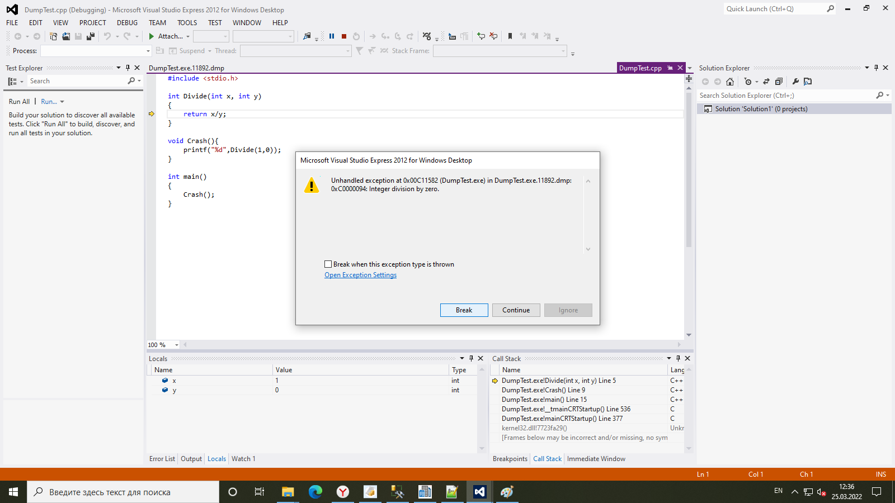
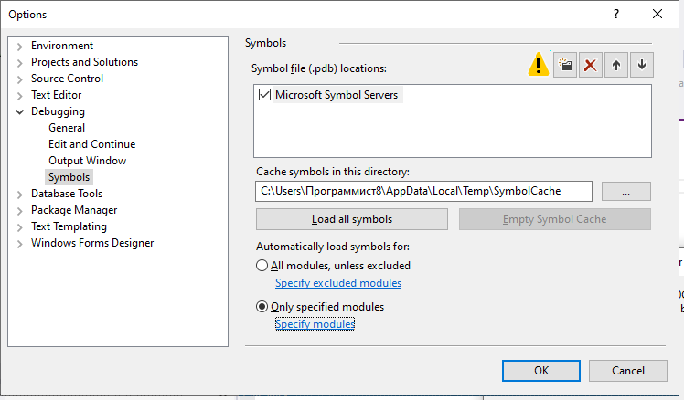
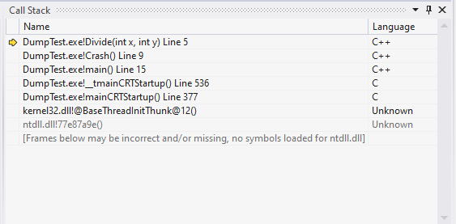
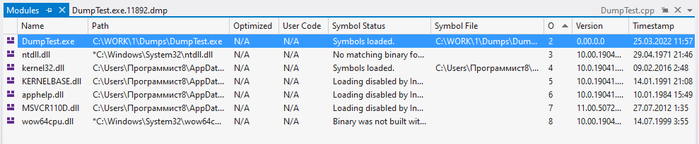

# Диагностика ошибок в программах с помощью дампов памяти

Обычно для поиска и устранения проблем в программах разработчики используют интегрированную среду разработки (IDE), запуская под отладчиком живой процесс и исследуя его память. Но иногда проблема возникает редко и только в специфичных условиях, поэтому ее не получается воспроизвести на машине разработчика, где установлен отладчик. Тогда есть несколько путей: удаленная отладка, использование логов или данных телеметрии, а также запись и анализ дампов памяти. Последний способ мы и рассмотрим в данной статье. Рассматривать работу с дампами мы будем на примере Windows 7+ и Visual Studio 2012+. Статья в основном рассчитана на разработчиков, но может также быть полезна администраторам и продвинутым пользователям.

Бесплатную для некоммерческого использования версию Visual Studio можно скачать здесь: <https://visualstudio.microsoft.com/ru/vs/community/>. При установке выберите рабочую нагрузку "Desktop development with C++".

## Настройка компьютера для записи дампов пользовательской памяти

Много в интернете понаписано про использование дампов памяти ядра для диагностики синих экранов (BSoD), но менее известно, что аналогичный механизм можно использовать и для обычных приложений (уровня пользователя). Но по умолчанию такие дампы при сбоях программ не сохраняются, нужны специальные настройки в реестре: [Collecting User-Mode dumps](https://docs.microsoft.com/en-us/windows/win32/wer/collecting-user-mode-dumps).

1. Открываем редактор реестра (**Пуск** - **Выполнить** - regedit).
2. Переходим в раздел `HKEY_LOCAL_MACHINE\SOFTWARE\Microsoft\Windows\Windows Error Reporting`
3. Создаем раздел LocalDumps, если его нет
4. Создаем в разделе ключи:

- DumpFolder (Расширяемый строковый параметр/REG_EXPAND_SZ) - Путь к каталогу, в который будут сохраняться дампы
- DumpType (Параметр DWORD) - Тип дампа (задаем значение 1 - минидамп)
- DumpCount (Параметр DWORD) - Максимальное количество дампов в каталоге, по умолчанию 10

Минидамп отличается от полного дампа только компактностью, т.е. данные сжимаются более эффективно. Вся необходимая информация для диагностики в минидамп включена, поэтому смело выбираем его. Подробнее о типах дампов можно почитать здесь: [User mode dump files](https://docs.microsoft.com/en-us/windows-hardware/drivers/debugger/user-mode-dump-files#minidumps).

Максимальное количество дампов можно задать для экономии дискового пространства, на случай, если какая-то программа постоянно будет падать и плодить дампы. Когда количество дампов превысит максимальное, старые будут перезаписаны.

Готово, теперь при критическом сбое в любой программе (необработанное исключение SEH/C++/.NET) в указанном каталоге будет создан файл дампа памяти (.dmp). Файл дампа содержит информацию об адресном пространстве упавшего процесса в момент сбоя, которую мы далее будет анализировать.

**Примечание.** Данные настройки следует устанавливать на машине пользователя, на которой программа будет запускаться. В нашем случае для простоты машины разработчика и пользователя будут одной и той же машиной.

## Тестовая программа для демонстрации сбоя

Чтобы продемонстрировать работу с дампами, напишем такую простую программу на С++:

```
#include <stdio.h>

int Divide(int x, int y)
{
	return x/y;
}

void Crash(){
	printf("%d",Divide(1,0));
}

int main()
{
	Crash();	
}
```

Как можно видеть из кода, программа пытается разделить целое число на ноль, и поэтому должна выдать при запуске необработанное исключение SEH. Соберем программу как консольное приложение С++ в Visual Studio (можно использовать Express), в конфигурации Debug. Запустите программу и убедитесь, что она упала и дамп записался. Если вы переносите программу на другой компьютер, переносите ее вместе в символами (файлом .pdb), иначе анализ дампа будет затруднен.

## Анализ дампа памяти в помощью Visual Studio

Популярный инструмент для анализа дампов - это WinDBG, но часто проще использовать Visual Studio. Для анализа дампа берем файл .dmp, нажимаем по нему правой кнопкой мыши и выбираем Открыть с помощью - Visual Studio. Отроется окно Visual Studio:



Нажимаем в нем **Отладка с использованием только машинного кода** (**Debug with Native only**). Откроется окно, в котором отображаются данные об исключении:



В окне можно увидеть код исключения (NTSTATUS), его описание, информацию о последовательности вызовов функций, которая привела к нему, и даже строку кода в файле .cpp исходного кода, на которой остановилось выполнение программы. Нажмите **Прервать** (**Break**), чтобы остановить отладку и изучить состояние программы более подробно. В окне **Стек вызовов** (**Call stack**) отображаются функции, последовательность которых привела к сбою. Каждый элемент списка называется кадром стека. Для кадра стека отображается модуль (EXE/DLL) и название функции после восклицательного знака. Двойным щелчком по функции можно перейти к ее исходникам, если они доступны. Также можно использовать меню **Debug** - **Windows** - **Threads** для отображения всех потоков, которые были активны в момент ошибки. В этом окне можно перейти и к стекам других потоков.

Из рисунка также видно, что для кадра стека из kernel32.dll не отобразилось имя функции. Это происходит, потому что символы для системных библиотек по умолчанию не загружаются. Рассмотрим, как включить загрузку символов.

## Настройка загрузки символов в Visual Studio

[Отладочные символы](https://docs.microsoft.com/en-us/windows/win32/dxtecharts/debugging-with-symbols) - это файл, который содержит информацию, необходимую для отладки. В первую очередь это таблица соответствия адресов памяти в исполняемом файле и имен функций, к которым относится код по этому адресу. Также символы могут содержать и информацию о строках файла исходников, соответствующих адресам кода в бинарнике (для продуктов с закрытым кодом этого обычно не будет). Для включения загрузки символов с серверов Microsoft выбираем в меню **Options and settings** - **Debugging** - **Symbols**. В открывшемся окне устанавливаем галку **Microsoft symbol servers**.



Можно включить загрузку всех символов, но тогда они грузиться будут долго. Пока включим лишь для одной библиотеки, для этого установим переключатель в значение **Only specified modules**, и нажмем **Specify modules**. В открывшемся окне добавим kernel32.dll, и отметим его галкой. Теперь переоткроем дамп, дождемся загрузки символов, и увидим, что название функции из kernel32.dll появилось:



Для библиотек собственной разработки также нужно будет включить загрузку символов, только вместо сервера символов указать путь к каталогу. Обратите внимание, что в нашем упрощенном случае символы для модуля программы DumpTest.exe загрузились автоматически, так как на компьютере и бинарник программы и символы лежали по тому же пути, что и сохранен в дампе. При переносе дампа на другой компьютер это в общем случае может не соблюдаться, тогда понадобится либо прописать путь для каталога с символами, либо загрузить символы вручную.

Для просмотра списка модулей и информации о загруженных символах выберите в меню **Debug** - **Windows** - **Modules**



Если в графе **Symbol status** отображается, что символы не прогрузились, можно подсунуть их вручную. Для этого нужно нажать по модулю правой кнопкой мыши и выбрать в меню **Load symbols from** - **Symbol path**. В появившихся диалоговых окнах нужно будет выбрать исполняемый файл и файл символов (иногда только что-то одно, если второе нашлось автоматически). При этом следует предоставить именно тот исполняемый файл, который использовался процессом, и именно те символы, которые соответствуют этому исполняемому файлу. В исполняемом файле в Debug directory прошивается специальный идентификатор символов; если файл символов ему не соответствует, отладчик пошлет вас подальше...

---

Таким образом, мы научились сохранять и анализировать дампы памяти для диагностики трудновоспроизводимых сбоев в программах для Windows. В Linux/Unix, к слову, аналогом этого метода будет использование [Core dumps](https://rtfm.co.ua/linux-sozdanie-coredump-pamyati-processa-debian-i-systemd-coredump/) и их анализ с помощью GDB. Один из главных плюсов дампов памяти в том, что не нужно вносить никаких изменений в код, как это было бы в случае добавления дополнительного логирования. Если вы хотите реализовать аналогичную диагностику, с получением стеков, через логирование, для этого можно использовать библиотеку [ErrLib](https://github.com/MSDN-WhiteKnight/ErrLib).

(C) SmallSoft, 2022 - http://smallsoft2.blogspot.com/
